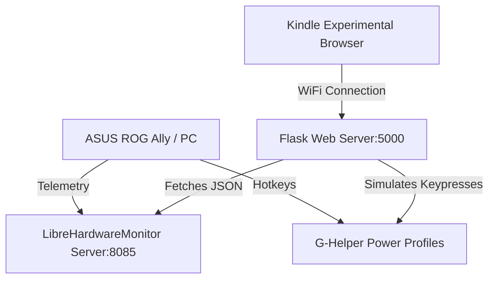

# Kindle E-Ink G-Helper Remote Dashboard

An ultra-clean, high-contrast remote hardware telemetry dashboard and power profile controller for ASUS ROG Ally (or any Windows gaming PC) powered by G-Helper, LibreHardwareMonitor, and an Amazon Kindle.

This project repurposes an old or active Amazon Kindle as an external hardware display and control deck, utilizing the Kindle's Experimental Web Browser to monitor temperatures and trigger G-Helper modes wirelessly.

---

## 📸 Overview



### Key Features
* 🔋 **E-Ink Optimized Layout:** High-contrast black & white design with large, touch-friendly buttons optimized for Kindle screen refresh rates.
* 🌡️ **Real-time Telemetry:** Live temperature feedback for both CPU and GPU (handles eGPU setups like RTX 3080M gracefully).
* ⚡ **Remote Profile Control:** Instantly switch between **SILENT**, **BALANCED**, and **TURBO** profiles by tapping the Kindle screen.
* 👻 **Ghosting Prevention:** Fully refreshes the page every 60 seconds to eliminate e-ink ghosting and preserve readability.

---

## 🛠️ Requirements & Setup

### 1. Kindle Preparation (Disable Sleep)
To use the Kindle as a persistent hardware monitor:
1. Open the search bar on your Kindle Home Screen.
2. Type **`~ds`** (disable sleep) and press **Enter**.
3. *Note: No message will appear, but the Kindle will now remain awake.* To undo this, hold the power button for a hard reset.

### 2. PC Setup: LibreHardwareMonitor
1. Download and run [LibreHardwareMonitor](https://librehardwaremonitor.org/).
2. Go to **Options** -> **Remote Web Server**.
3. Set the **Port** to `8085`.
4. Click **Run** to start serving the system telemetry.

### 3. Python Flask Server Configuration
1. Ensure Python 3.8+ is installed.
2. Install dependencies:
   ```cmd
   pip install -r requirements.txt
   ```
3. Update `LHM_URL` inside `kindle_ghelper_server.py` if your PC's IP address is different:
   ```python
   LHM_URL = "http://localhost:8085/data.json"
   ```
4. Run the script as **Administrator** (necessary for simulating keypresses via `PyAutoGUI`):
   ```cmd
   python kindle_ghelper_server.py
   ```

### 4. G-Helper Hotkey Setup
The server triggers G-Helper profiles by simulating keyboard combinations:
* **Silent Mode:** `Ctrl + Shift + Alt + F16`
* **Balanced Mode:** `Ctrl + Shift + Alt + F17`
* **Turbo Mode:** `Ctrl + Shift + Alt + F18`

Ensure these custom key bindings are set up in G-Helper's **Extra** settings menu or mapped using AutoHotkey.

---

## 🌐 Connecting the Kindle

1. Connect your Kindle to the same local Wi-Fi subnet as your PC.
2. Open the Kindle's **Experimental Web Browser**.
3. Navigate to `http://<YOUR_PC_IP>:5000` (e.g., `http://192.168.1.50:5000`).
4. Keep the Kindle docked next to your screen for an instant control center!

---

## 📝 GitHub / Git Repository Push Guide

To push this project to a new GitHub repository, run the following commands in the project directory:

```bash
# Initialize a local Git repository
git init -b main

# Add all files to staging (ignoring virtualenv and installers automatically)
git add .

# Create the initial commit
git commit -m "Initial commit: G-Helper Kindle Dashboard setup"

# Create a new repository on GitHub (using GitHub CLI)
gh repo create GHelperDash --public --source=. --remote=origin --push
```

---

## 🛡️ Troubleshooting & License
For detailed troubleshooting of timeouts, N/A readings, and PyAutoGUI permissions, refer to [troubleshooting.md](file:///C:/Users/fdjok/gemini/GHelperDash/troubleshooting.md). Distributed under the MIT License.
